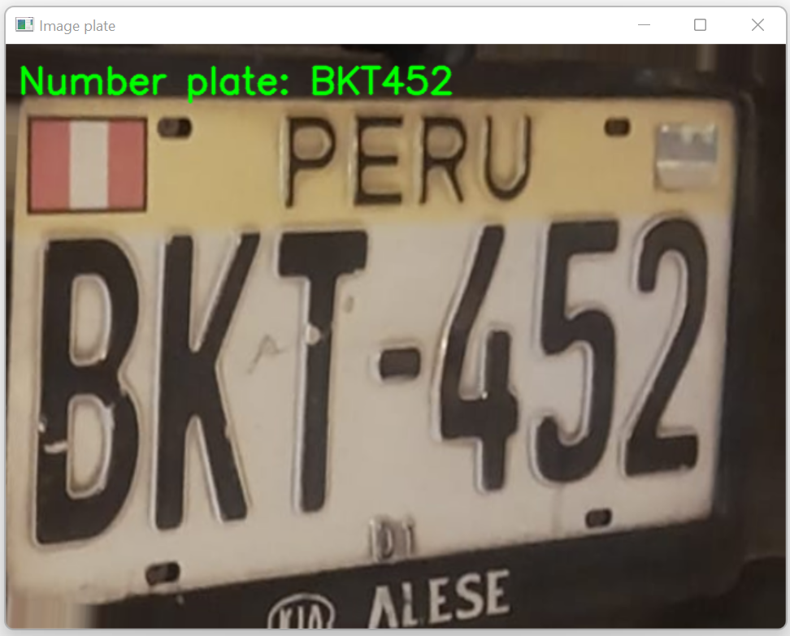

# 🚘 ANPR (Automatic Number Plate Recognition)

This project performs **ANPR** using artificial intelligence models and image processing.  


## 📖 Description  
The system detects license plates in images and extracts the plate text using two trained **YOLO** models:  
- One for locating the **plate**.  
- Another for recognizing the **characters**.  


## ⚙️ Dependencies 

- [🔗 Ultralytics](https://github.com/ultralytics/ultralytics) (YOLO)  

- [🛠️ Supervision](https://github.com/roboflow/supervision)  


👉 Recommended installation:  
```bash
pip install ultralytics supervision polars
```

---

## ▶️ Usage  
1. Run `main.py`  
2. Enter the test image number (**1 – 30**) when prompted.  
3. The system will:  
   - 🖼️ Displays the image of the detected plate
   - 🔤 The image shows the number of the detected license plate.  


## 🔄 Main Code Flow  
1. 📥 Load YOLO models  
2. 🖼️ Read selected image  
3. 🎯 Detect plate and extract coordinates  
4. ✂️ Crop & rotate plate image  
5. 🤖 Apply OCR model for character recognition  
6. 👁️ Display results with plate text overlay  


## 📷 Example



## 📬 Contact

For questions or feedback, contact at `billysoplin@gmail.com`

---

## 📄 License

This project is licensed under the MIT License. See the [LICENSE](LICENSE) file for details.

---